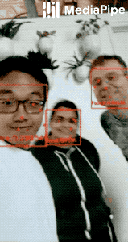

# AI Pose Estimation
**Goal: Real time pose detection  using MediaPipe, OpenCV and Python**

**Language: Python**

**Steps to implement AI Pose Estimation**

* Step 1: Install MediaPipe for python using pip install
* Step 2: detect hands from real time webcam feed
* Step 3: Output images using OpenCV

**Steps to implement Sign Language Detection in real time**

* Step 1: Collect data of hands, body face and save them as Numpy Arrays
* Step 2: Train a deep neural network with LSTM layers for sequences to predict the temporal component. So that we are able to prodict the action from a number of frames
* Step 3: Put it all together - perform real time sign language detection using OpenCV

**MediaPipe**

--------------------------------------------------------------------------------

## Live ML anywhere

[MediaPipe](https://google.github.io/mediapipe/) offers cross-platform, customizable
ML solutions for live and streaming media.!

                                                               | 
:------------------------------------------------------------------------------------------------------------: | :----------------------------------------------------:
***End-to-End acceleration***: *Built-in fast ML inference and processing accelerated even on common hardware* | ***Build once, deploy anywhere***: *Unified solution works across Android, iOS, desktop/cloud, web and IoT*
                                                             | 
***Ready-to-use solutions***: *Cutting-edge ML solutions demonstrating full power of the framework*            | ***Free and open source***: *Framework and solutions both under Apache 2.0, fully extensible and customizable*

## ML solutions in MediaPipe

Face Detection                                                                                                                 | Face Mesh                                                                                                       | Iris                                                                                                      | Hands                                                                                                      | Pose                                                                                                      | Holistic
:----------------------------------------------------------------------------------------------------------------------------: | :-------------------------------------------------------------------------------------------------------------: | :-------------------------------------------------------------------------------------------------------: | :--------------------------------------------------------------------------------------------------------: | :-------------------------------------------------------------------------------------------------------: | :------:
 |  |  |  |  | 

Hair Segmentation                                                                                                                       | Object Detection                                                                                                                     | Box Tracking                                                                                                                | Instant Motion Tracking                                                                                                                               | Objectron                                                                                                             | KNIFT
:-------------------------------------------------------------------------------------------------------------------------------------: | :----------------------------------------------------------------------------------------------------------------------------------: | :-------------------------------------------------------------------------------------------------------------------------: | :---------------------------------------------------------------------------------------------------------------------------------------------------: | :-------------------------------------------------------------------------------------------------------------------: | :---:
 |  |  |  |  | 

**References:**
* MediaPipe framework : https://github.com/google/mediapipe
* OpenCV : https://github.com/opencv/opencv
* Two Minutes Paper youtube link: https://www.youtube.com/watch?v=F84jaIR5Uxc
* Google Blog on MediaPipe Holistic — Simultaneous Face, Hand and Pose Prediction, on Device : https://ai.googleblog.com/2020/12/mediapipe-holistic-simultaneous-face.html
